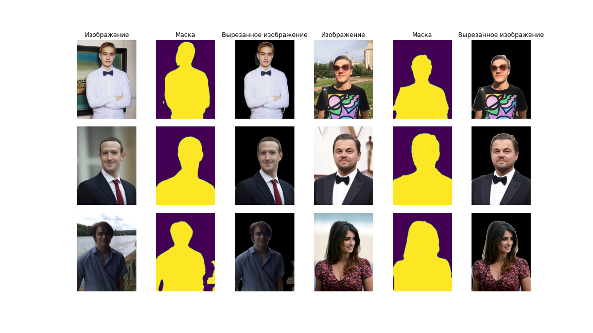

# HumanSegmentation

Это репозиторий - решение https://github.com/machine-intelligence-laboratory/MILTestTasks/tree/task/human_segmentation

**Требуется**: предложить модель, сегментирующую человека на фотографии.

Были рассмотрены следующие архитектуры нейронных сетей:

### Ванильная UNet

### SDUNet

https://arxiv.org/ftp/arxiv/papers/2004/2004.03466.pdf

Основное отличие от UNet заключается в использовании dilated convolutions. Они позволяют нейронам увеличивать область восприятия, то есть они обладают информацией о б**о**льшей части изображения.

### LinkNet

https://arxiv.org/pdf/1707.03718.pdf

Архитектура похожа на UNet, но отличается использованием residual connections вместо конкатенации выходов энкодера и декодера

### HRNet

Описание есть здесь: https://arxiv.org/pdf/2001.05566.pdf

Основная идея состоит в том, чтобы одновременно поддерживать несколько сверточных последовательностей с разными разрешениями. Информация  между последовательностями передается с помощью upsample / downsample сверток.

### Таблица с данными об обучении моделей:

runs 0-9 обучались на картинках исходного размера 320x240, 10-13 на уменьшенных картинках 192x144. При этом train и val метрики считаются на картинках исходного размера.

| index | run_id | run_name | model_name | pretrained_weights | num_epochs | val_loss | val_dice | train_loss | train_dice |
| :--- | :--- | :--- | :--- | :--- | :--- | :--- | :--- | :--- | :--- |
| 0 | 3i4uqxlh | vanilla_unet_1 | VanillaUNet |  | 25 | 0.16999 | 0.94913 | 0.13602 | 0.96174 |
| 1 | 2kzf0p5b | sdunet_1 | SDUNet |  | 25 | 0.14365 | 0.95207 | 0.10383 | 0.96804 |
| 2 | 2dz6j77q | linknet_1 | LinkNet |  | 25 | 0.22655 | 0.91866 | 0.19992 | 0.93044 |
| 3 | ep6g98jx | hrnet_1 | HRNet |  | 25 | 0.43186 | 0.87979 | 0.41063 | 0.88871 |
| 4 | 35wog0h3 | hrnet_2 | HRNet | hrnet_1_best.pt | 50 | 0.36174 | 0.95942 | 0.31496 | 0.97897 |
| 5 | pln4asmc | vanilla_unet_augmentations1_2 | VanillaUNet | vanilla_unet_1_best.pt | 25 | 0.1187 | 0.95723 | 0.09208 | 0.96901 |
| 6 | fhniugmq | sdunet_augmentations1_2 | SDUNet | sdunet_1_best.pt | 25 | 0.12922 | 0.95093 | 0.08706 | 0.97025 |
| 7 | 25e3yvaa | linknet_augmentations1_2 | LinkNet | linknet_1_best.pt | 25 | 0.18572 | 0.93076 | 0.16382 | 0.94124 |
| 8 | 3lqymzcf | hrnet_augmentations1_3 | HRNet | hrnet_2_best.pt | 25 | 0.35443 | 0.95862 | 0.32572 | 0.9702 |
| 9 | 1bvhg5qw | linknet_augmentations2_3 | LinkNet | linknet_augmentations1_2_best.pt | 75 | 0.19176 | 0.92885 | 0.16107 | 0.94123 |
| 10 | 9q2vzhda | lowres_hrnet_1 | HRNet |  | 100 | 0.37878 | 0.93733 | 0.35894 | 0.94286 |
| 11 | 24tso77h | lowres_vanilla_unet_1 | VanillaUNet |  | 75 | 0.16585 | 0.93909 | 0.14153 | 0.9481 |
| 12 | 1qx29ajc | lowres_sdunet_1 | SDUNet |  | 100 | 0.17434 | 0.93731 | 0.14698 | 0.94898 |
| 13 | 1a2djffv | lowres_linknet_1 | LinkNet |  | 100 | 0.21442 | 0.92343 | 0.1733 | 0.94 |

Метрики у итоговой модели (ансамбль всех четырех архитектур, обученных на картинках 192x144 + пост-процессинг):
| val_loss | val_dice | train_loss | train_dice |
| :--- | :--- | :--- | :--- |
| 0.10091 | 0.96611 | 0.06096 | 0.98361 |

Пример работы с картинками не из датасета:

[Ноутбук с решением задачи](https://github.com/bumchik2/HumanSegmentation/blob/main/notebooks/research.ipynb)

[wandb проект с логами обучения](https://wandb.ai/bumchik2_team/human_segmentation)

[Результаты](https://github.com/bumchik2/HumanSegmentation/tree/main/results/submit)
